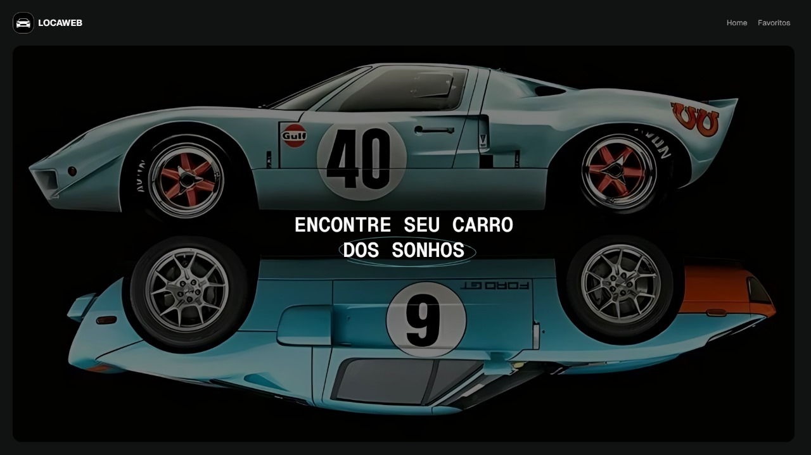

# Locadora de carros

> Status : Finished project ✅ / Open PR

## Vai na Web - Challenge

_Technologies_

- Next.js 🚀
- SASS 🎨
- Swiper.js 🔄
- AOS (Animate On Scroll) 📈
- Dotenv 📦

### Requirements
- Node.js (v20.15.0) or higher
- NPM (v10.8.1)

### How to use

- git clone https://github.com/12Gustavo21/hiring-front-end-pag.git or download the zip
- npm install or yarn install
- code . (if you use VSCode)
- npm run dev or yarn dev

### Creating a .env.local file

- Create a .env.local file in the root of the project
- Create the variable: NEXT_PUBLIC_API_URL
- Go to the link: https://api-ninjas.com
- Create an account (if you don't have one) and get the API key 
- Add the API key to the variable NEXT_PUBLIC_API_URL

### How to build

- npm run build or yarn build

### How to run deploy

- vercel
- access the link generated by vercel (inspect or preview)

## 💻 Online Page: https://locadora-vnw.vercel.app